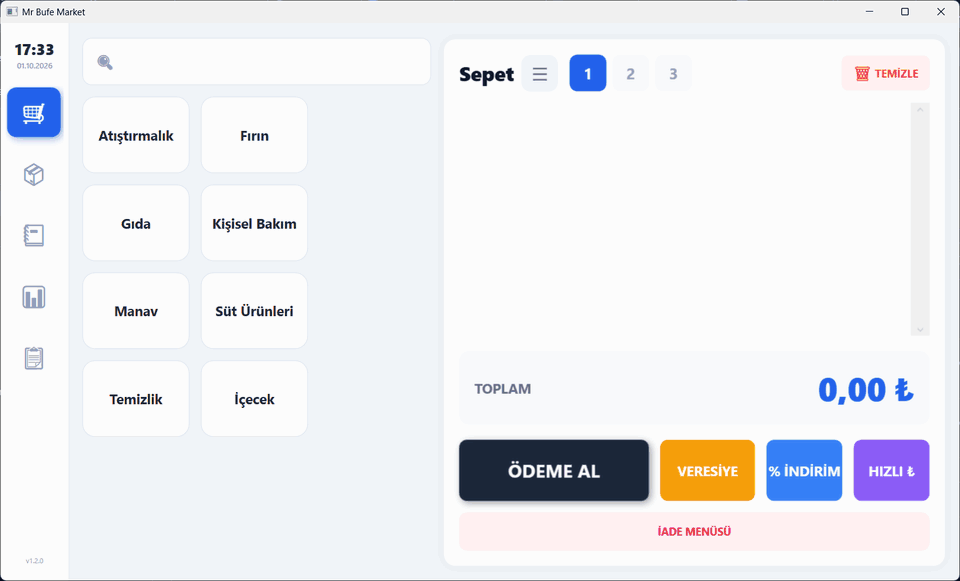
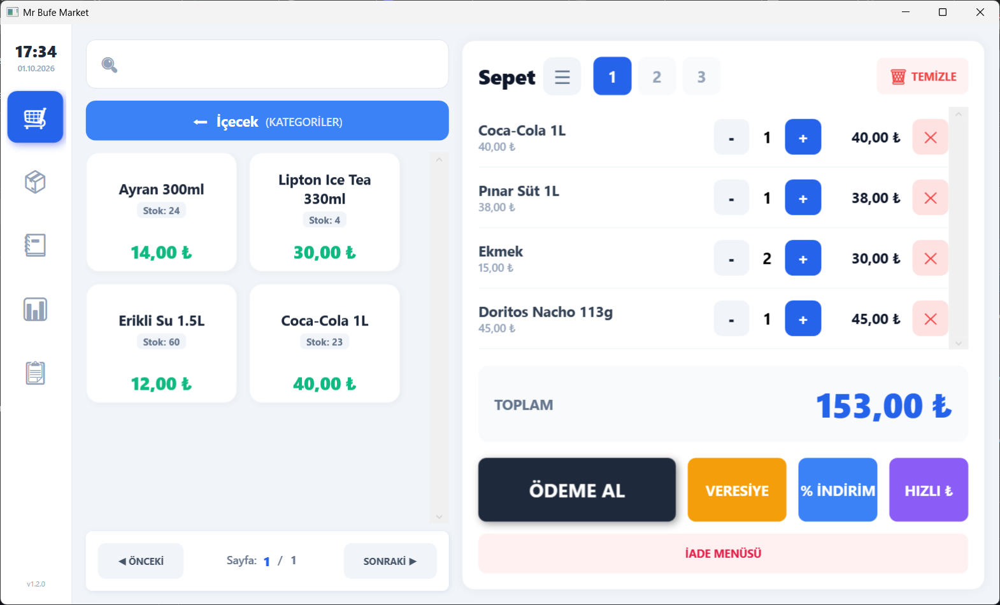
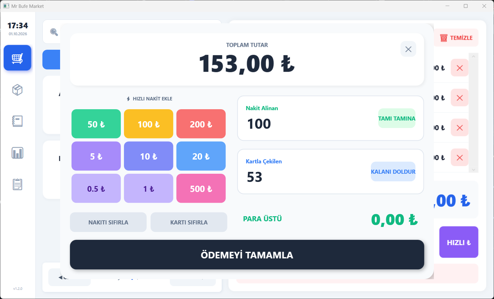
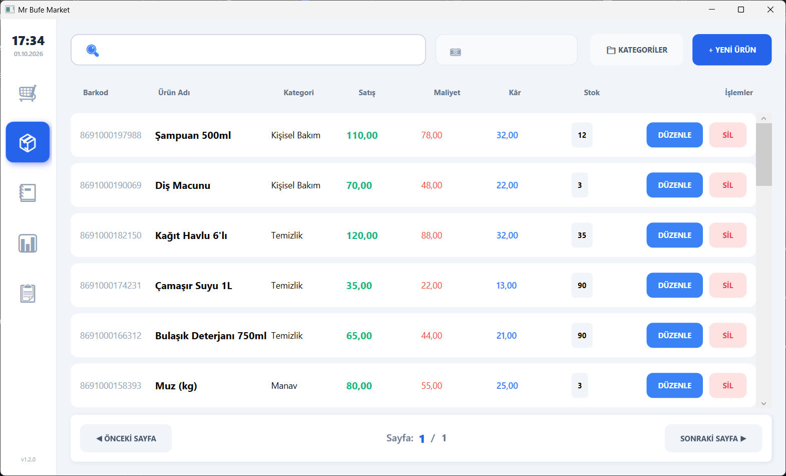
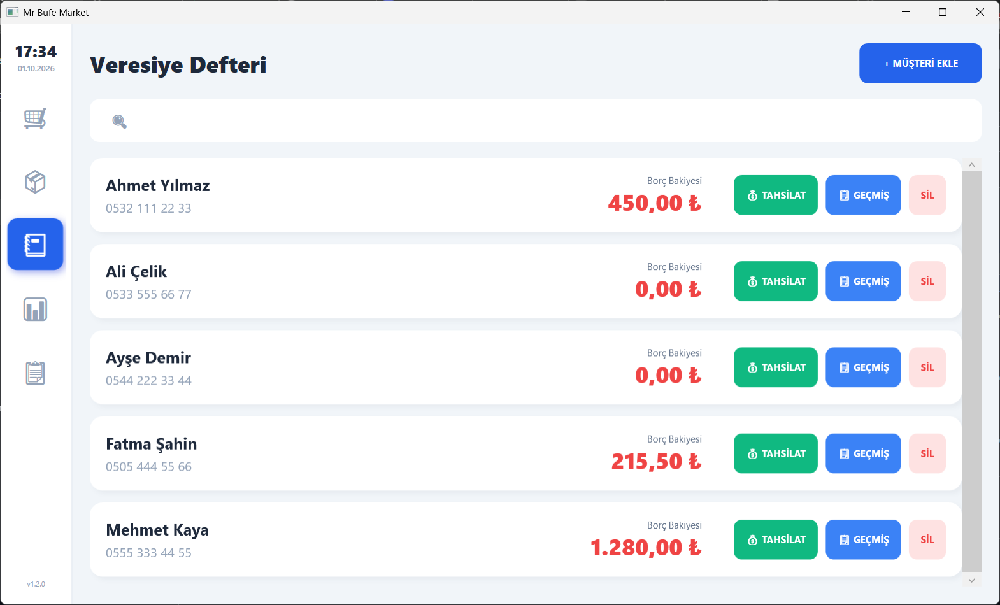
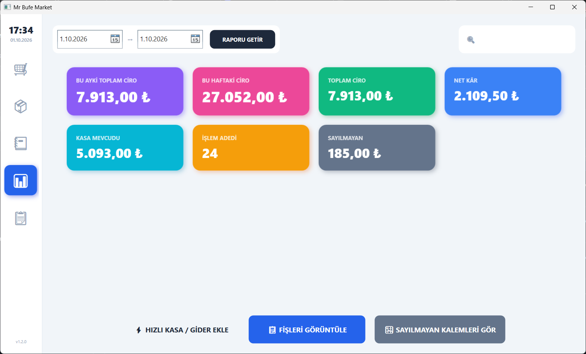
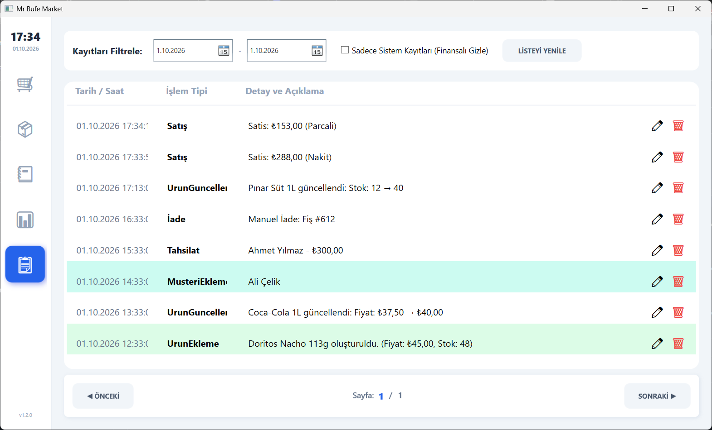

<div align="center">


# MarketPOS

**A fast, offline point-of-sale app for small markets and kiosks.**
Scan a barcode, take the payment, and the stock and daily reports update on their own.

[](https://github.com/MetehanDemirel/MarketPOS-App/releases/latest)




</div>

## What it does

MarketPOS runs the till of a small shop. It's a single Windows app with a local database and no server or account. It keeps working when the internet is down.

- **Barcode checkout:** scan with any USB barcode reader (it types the code and presses Enter), or tap products on the touch-friendly category tiles.
- **3 parallel carts:** park a customer's basket and serve the next one.
- **Flexible payment:** quick cash buttons, card, or **split cash + card**, with the change worked out for you. You can also add a discount (%) or a custom amount.
- **Inventory:** products with barcode, category, sale price, cost and **per-item profit**. Search by name or barcode. Stock goes down with each sale, and the till won't sell an item that's out of stock.
- **Credit book (*veresiye*):** sell on credit to regular customers, track each customer's balance and take partial payments later.
- **Reports:** daily, weekly and monthly revenue, net profit, cash in the drawer and number of transactions, for any date range.
- **"Uncounted" categories:** for items you don't keep stock counts on, like bread or produce. They're still reported separately.
- **Receipts and refunds:** browse every receipt with its line items and refund a whole sale in two clicks.
- **Audit log:** every product edit, refund, payment and new customer is logged with a timestamp.
- **Safe by default:** the SQLite DB runs in WAL mode, and the app makes an automatic daily backup to `Yedekler/`.
- **Self-updating:** checks GitHub for a new release on startup and updates itself.

## Screenshots

| Sales | Payment |
|:---:|:---:|
|  |  |
| **Inventory** | **Credit book** |
|  |  |
| **Reports** | **Activity log** |
|  |  |

<details>
<summary><b>Quick tour of all tabs (GIF)</b></summary>
<br>

</details>

> All screenshots use generated demo data.

## Install

1. Download the latest `.zip` from **[Releases](https://github.com/MetehanDemirel/MarketPOS-App/releases/latest)**.
2. Extract it anywhere (e.g. `C:\MarketPOS`) and run **`Mr Bufe Market.exe`**.

The release is self-contained, so you don't need to install .NET. On first run the app creates `MarketDB.db` next to the exe.

> **Back up your data:** copy `MarketDB.db` (and the `Yedekler/` folder) to back up or move the shop to another PC.

## Build from source

Requires Windows and the [.NET 8 SDK](https://dotnet.microsoft.com/download/dotnet/8.0).

```bash
git clone https://github.com/MetehanDemirel/MarketPOS-App.git
cd MarketPOS-App
dotnet run --project MarketPOS
```

Self-contained release build (same as the published zips):

```bash
dotnet publish MarketPOS -c Release -r win-x86 --self-contained true -o publish
```

## Tech stack

| | |
|---|---|
| UI | WPF (.NET 8), MVVM with [CommunityToolkit.Mvvm](https://github.com/CommunityToolkit/dotnet) |
| Data | SQLite via [Microsoft.Data.Sqlite](https://learn.microsoft.com/dotnet/standard/data/sqlite/) + [Dapper](https://github.com/DapperLib/Dapper), indexed and with schema migrations on startup |
| Updates | [AutoUpdater.NET](https://github.com/ravibpatel/AutoUpdater.NET), driven by [`update.xml`](update.xml) |

```
MarketPOS/
├── MainWindow.xaml          # main shell: sales, inventory, credit book, reports, log
├── ViewModels/              # MainViewModel split per area (Sales, Inventory, Customers, Reports)
├── Services/DatabaseService.cs   # schema, migrations, queries, backups
├── Data/                    # models + constants
└── *Window.xaml             # dialogs: payment, refund, discount, customer, product…
```

## Releasing an update

The app reads [`update.xml`](update.xml) from this repo's `main` branch on startup. To ship a new version:

1. Bump `<Version>` in `MarketPOS/MarketPOS.csproj`.
2. Publish, zip the output, and create a GitHub release tagged with the version (e.g. `1.3.0.0`) with the zip attached.
3. Update `version`, `url` and `changelog` in `update.xml`.

## UI language

The interface is in Turkish. Main terms:

| Turkish | English |
|---|---|
| Sepet | Cart |
| Ödeme Al | Take payment |
| Veresiye | On credit |
| Tahsilat | Debt payment |
| İade | Refund |
| Envanter / Stok | Inventory / Stock |
| Ciro / Net Kâr | Revenue / Net profit |
| Kasa Mevcudu | Cash in drawer |
| Sayılmayan | Uncounted (no stock tracking) |

## License

[MIT](LICENSE)
